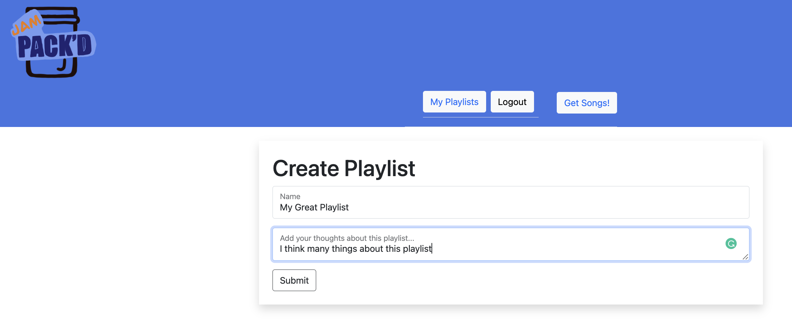

# Site Navigation and Usage

- In your browser, naviagating to <https://semi-serious-solutions.gitlab.io/jam-packd/> will bring you to the home page

- To make use of the site's functions you must first have an account.
- Use the navigation buttons to enter the sign-up page and enter you personal details to create an account

- Once you have selected a genre the player window will appear.
- Here you may press play to start lsitening to the track(s), like, skip songs, and create a playlist when you feel you are done.
- Currently you are limited to a beggining seelction of 20 songs
- If you have spotify premium you will be able to listen to an entire song, otherwise you are lmited to a 30 second clip.

- Once you have finished all the songs availble the like and skip buttons as well as the song player will dissapear, leaving only the option to get new songs from another genre or to make a playlist

- If you choose to make a playlist at this step you will be redicreted to a page to enter the playlist name and comments about the playlist

- Once you've named and commented on playlist and hit done you will be navigated to the page containing your newly created playlist.
- Here you will see the name, artist and a mini-player for each of the songs in your playlist.
- At the top of the page, you are also able to either edit or delete your newly create playlist

- On the Update Playlist page, you can change the playlist's name and comments

- If you delete your playlist a notification will appear informing you that the deletion was sucessful

- On the My Playlists page, you will see a list of all your playlists which you can then click into.

And that is the basics of our current site navigation! Hope you enjoy!
